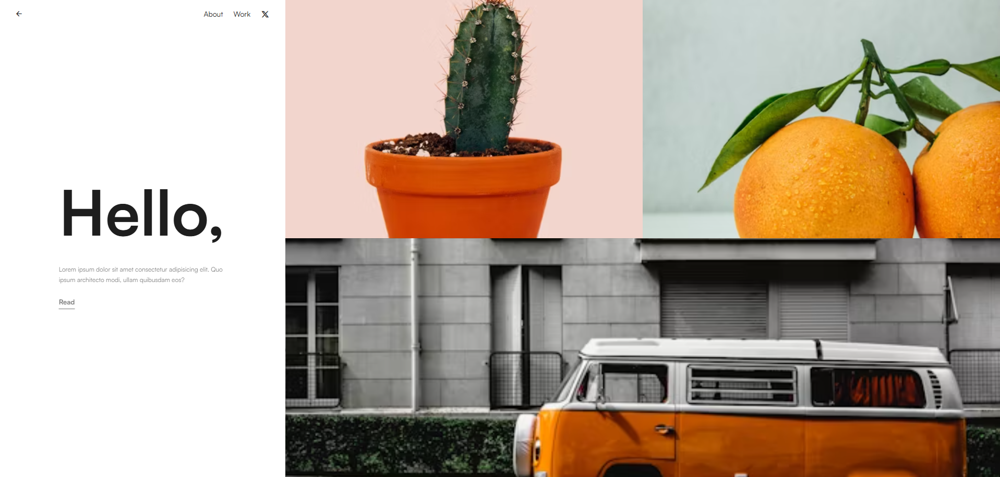
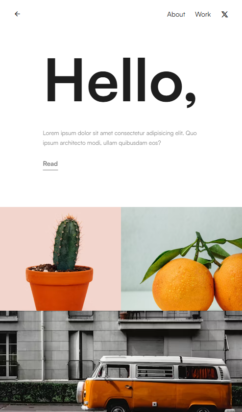

# Responsive Web Layout

This project is a modern, responsive web layout built using **HTML** and **CSS**. It features a two-section layout with a left content area and a right image gallery.

## Features
- Responsive layout using **Flexbox**
- Well-structured **HTML** and **CSS**
- **Media queries** for mobile responsiveness

## Folder Structure
```
project-folder/
│── index.html  # Main HTML file
│── styles.css  # Main CSS file
│── images/     # Folder for images (e.g., bus.avif, cactus.avif, orange.avif)
```

## Technologies Used
- **HTML5**
- **CSS3 (Flexbox, Media Queries)**
- **Google Fonts (Satoshi)**
- **Remix Icons**


## Responsive Design
The layout is designed to be fully responsive:
- **Desktop View**: Two sections, left for text and right for images.
- **Mobile View**: Sections are stacked for better readability.


## Screenshots

### Desktop View


### Mobile View


## Live Demo

You can view the live demo of the ResponsiveWebLayout project at [https://codewithzishan.github.io/ResponsiveWebLayout/](https://codewithzishan.github.io/ResponsiveWebLayout/).


